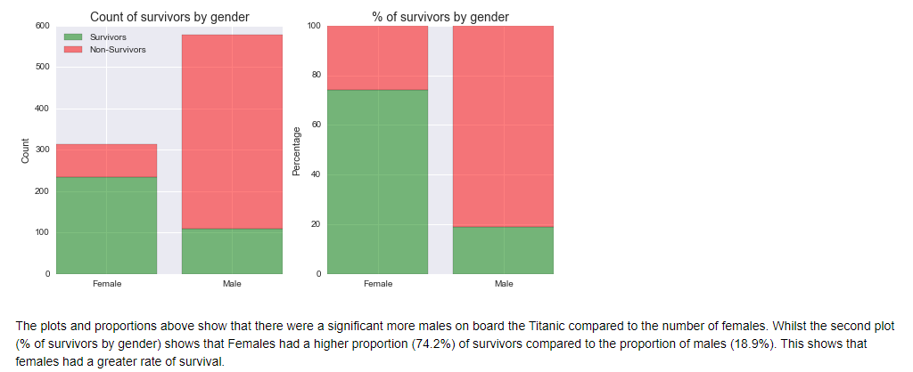
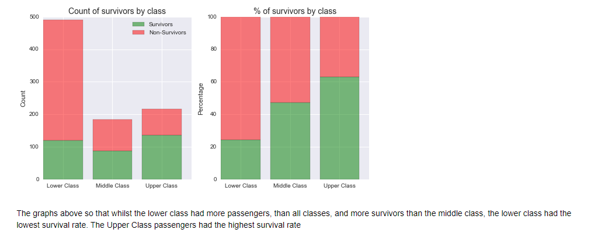
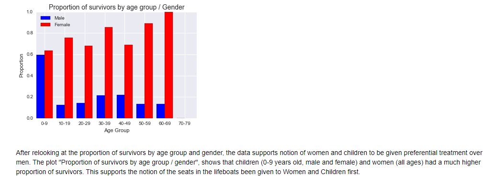

# Investigate A Dataset
This project involves the use of NumPy, Pandas, Matplotlib, Seaborn and Python to analyze a dataset. 
The dataset I choose was the Titanic Dataset provided by [Kaggle](https://www.kaggle.com/hesh97/titanicdataset-traincsv).

## Repository Structure
~~~~~~~
        Investigate A Dataset
          |-- data-set-options.pdf  # Links of some datasets.
          |-- titanic_data.csv    # Dataset used here.
          |-- Titanic Dataset Investigation.html Complete Analysis.
          |-- Titanic Dataset Investigation.ipynb    # A jupyter notebook contains all the code.
          |-- README
~~~~~~~

An online version of the report can be viewed here: [Report](https://tanmayachaudhary.github.io/Investigate_A_Dataset/Titanic%20Dataset%20Investigation.html)

## Output Snapshots
**Q1-> Which gender had a better chance of survival?**

**Q2-> Which social class had a better chance of survival?**

**Q3-> Which age group had a better chance of survival?**

